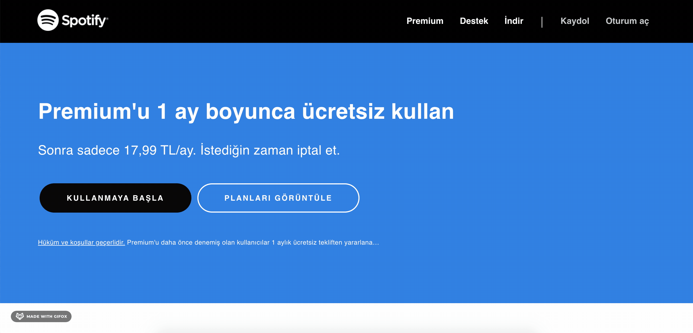

# Spotify Clone

This project is coded for Kodluyoruz JavaScript & React Bootcamp.
Spotify Web Api was used to fetch real data.
To be able to see the content, you must login to your Spotify account and give related permissions.
You can search tracks, artists and albums, and get the hit playlists.

## Important!

To be able to view the page fully functional, your Spotify email address should be submitted to Spotify Dashboard for the app. You can send your Spotify email address to mchtugr@gmail.com.

## Run locally

Clone the project

```bash
  git clone https://github.com/mchtugr/spotify-clone.git
```

Proje dizinine gidin

```bash
  cd spotify-clone
```

Gerekli paketleri yükleyin

```bash
  npm install
```

Sunucuyu çalıştırın

```bash
  npm run start
```

## Screenshot

#### Offers Page & Login



#### User playlists & artists


#### Search Page


#### Hit playlists detail


## Built with

- React
- Redux
- Redux Thunk
- Redux Persist
- React Router
- React icons
- React i18next
- Spotify Web Api

## Contributing

Pull requests are welcome.
For major changes, please open an issue first to discuss what you would like to change.

## License

[MIT](https://choosealicense.com/licenses/mit/)
